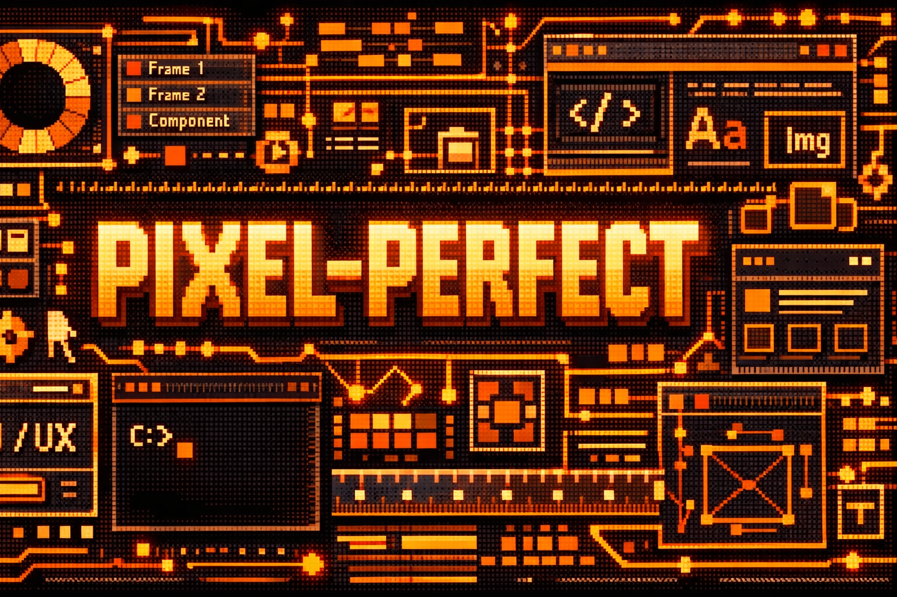

<p align="center">
  
</p>

# pixel-perfect

A Claude Code plugin for tech-agnostic UI/UX design workflows. Transform product requirements into structured design artifacts and HTML mockups that serve as blueprints for AI-assisted implementation.

---

## Why HTML Mockups?

Picture this: You've just finished designing your next app. It's gorgeous. The UX makes sense. Surely in the age of AI you can go from design to prototype with the click of a button...

Except that's never how it turns out. The AI gives you a component that kind of looks right if you squint—hardcoded colors, magic numbers everywhere, and structural logic that suggests the AI was having an existential crisis mid-generation.

**Here's the insight that changes everything:** AI doesn't *see* your designs the way you do. When an AI looks at a screenshot, it's processing pixels—reverse-engineering intent from a grid of colors. It's working backwards from the finished painting to guess what brushstrokes made it.

But give that same AI *text*—structured, semantic text like HTML—and suddenly it's not guessing. It's reading the blueprint directly.

### What HTML Encodes That Screenshots Don't

| Aspect | Screenshot | HTML |
|--------|------------|------|
| **Structure** | Implied | Explicit parent-child relationships |
| **Hierarchy** | Visual guess | Semantic heading levels |
| **Semantics** | Unknown | Button vs div-pretending-to-be-button |
| **Spacing** | Pixel estimation | Padding, margin, flex gap explicitly defined |
| **Relationships** | Ambiguous | Icon inside button vs next to it |

A screenshot is a photograph. HTML is the blueprint. You wouldn't ask a contractor to build your house from a photograph of someone else's house—you'd give them architectural drawings.

### The Translation Advantage

When Claude reads HTML like this:

```html
<!-- Bottom Controls Pattern -->
<div class="flex items-center justify-center gap-6 p-4">
  <button class="flex size-14 items-center justify-center rounded-full">
    <span class="material-symbols-outlined">photo_library</span>
  </button>
  <button class="flex size-20 items-center justify-center rounded-full border-4">
    <div class="size-16 rounded-full bg-white"></div>
  </button>
  <button class="relative flex size-14 items-center justify-center">
    <span class="material-symbols-outlined">stacks</span>
    <div class="absolute -left-1 -top-1 h-6 w-6 rounded-full bg-primary">3</div>
  </button>
</div>
```

It *knows*:
- Three-button layout with specific gap spacing
- Button sizing hierarchy: capture button (size-20) dominates utility buttons (size-14)
- Icon-only buttons using Material Symbols
- A notification badge positioned absolutely on the stack button
- Flex layouts with explicit gaps and padding

From a screenshot, it would have to *guess* all of this.

---

## What is pixel-perfect?

This plugin provides a structured workflow for turning product requirements into implementable designs:

```
Requirements → Preplanning → Design Artifacts (YAML) → Specifications (JSON) → Mockups (HTML) → Review
```

*(PRD = Product Requirements Document—your feature specs and functionality requirements)*

### Core Concept

Instead of jumping from requirements to code, this plugin creates an intermediate **design layer**:

1. **Preplanning**: Interactive setup—confirm platforms, design vibe, analyze references
2. **Ideation**: Break down PRD into user workflows, screens, and flows
3. **Paradigm Research**: Study existing patterns and design systems
4. **Structured Artifacts**: Generate YAML files defining every aspect of the design
5. **HTML Blueprints**: Create mockups that Claude can read as implementation specs
6. **Review Loop**: Iterate until designs meet quality standards

The HTML mockups become your **Rosetta Stone**—the bridge between "that looks nice" and "that actually works."

---

## Quick Start

### Installation

This plugin is distributed as a **marketplace** (a collection of plugins hosted on GitHub). You must add the marketplace first, then install the plugin from it.

**Step 1: Add the marketplace** (required once)
```
/plugin marketplace add https://github.com/hackerpug-ai/pixel-perfect
```
This registers the pixel-perfect GitHub repo as a plugin source.

**Step 2: Install the plugin**
```
/plugin install pixel-perfect@pixel-perfect
```
The format is `plugin-name@marketplace-name`. Both are "pixel-perfect" in this case.

**Alternative: From your terminal** (outside Claude Code):
```bash
claude plugin marketplace add https://github.com/hackerpug-ai/pixel-perfect
claude plugin install pixel-perfect@pixel-perfect
```

**For local development:**
```bash
git clone https://github.com/hackerpug-ai/pixel-perfect.git
claude --plugin-dir ./pixel-perfect
```

---

### Command Pipeline

Commands must run **in sequence**. Each command checks that previous steps completed and will automatically run missing steps.

```
research (optional) → init → plan → prompts → mockups → review
```

| Step | Command | What it does |
|------|---------|--------------|
| 0 | `/pixel-perfect:research` | **(Optional) Research design patterns.** Search for UI/UX patterns, trends, and competitor designs. Saves to shared research library. |
| 1 | `/pixel-perfect:init` | **Configure the project.** Asks about requirements location, target platforms, and design vibe. Creates `design/config.yaml`. |
| 2 | `/pixel-perfect:plan` | **Generate design artifacts.** Reads your PRD and creates YAML files: tokens, components, flows, views, screens. Incorporates research if available. |
| 3 | `/pixel-perfect:prompts` | **Create spec files.** Converts views.yaml into detailed JSON specifications for each screen. |
| 4 | `/pixel-perfect:mockups` | **Generate HTML mockups.** Creates visual HTML files from the JSON specs. |
| 5 | `/pixel-perfect:review` | **Review mockups.** Compares mockups against specs and tracks approval status. |
| — | `/pixel-perfect:merge` | **Promote artifacts.** Merge design artifacts from child directory to parent scope. |
| — | `/pixel-perfect:refine` | **Iterate on designs.** Collect feedback and re-run affected design phases. |

**If you skip a step**, the next command will detect it and run the missing step first. For example, running `/pixel-perfect:mockups` without having run `plan` or `prompts` will trigger both automatically.

---

### Basic Usage

```bash
# Run full design workflow (recommended - runs all steps)
/pixel-perfect:design auth-flow

# Check progress anytime
/pixel-perfect:status auth-flow
```

**Smart path resolution:** Just use the folder name—the plugin finds it:
- `auth-flow` → finds `features/auth-flow`
- `lunch-menu` → finds `features/booking/sprints/lunch-menu`

**First run?** Init runs automatically and will ask you:
1. **Where are your requirements?** (auto-detects PRD.md or asks for location)
2. **What platforms?** (defaults to Responsive Web, or choose native iOS/Android/etc.)
3. **What's the design vibe?** (modern, minimal, playful, etc.)
4. **Any reference URLs to analyze?** (fetches and extracts patterns)

### Running Steps Individually

```bash
# 1. Initialize (configure project - runs automatically if needed)
/pixel-perfect:init directory-1

# 2. Plan (generate YAML artifacts from PRD)
/pixel-perfect:plan auth-flow

# 3. Prompts (create JSON specs from views.yaml)
/pixel-perfect:prompts directory-1

# 4. Mockups (generate HTML from specs)
/pixel-perfect:mockups directory-1

# 5. Review (compare mockups against specs)
/pixel-perfect:review directory-1
```

---

## Commands

### /pixel-perfect:research

Research UI/UX design patterns, trends, and competitor designs. Saves findings to a shared research library that informs the planning phase.

**Usage:**
```
/pixel-perfect:research <query> [options]
/pixel-perfect:research --topic <topic> [options]
/pixel-perfect:research --trend <trend-name> [options]
/pixel-perfect:research --competitor <url> [options]
```

**Options:**
- `--topic <topic>` - Research a specific design topic (e.g., "mobile-navigation", "form-design")
- `--trend <name>` - Research current design trends (e.g., "bento-grids", "glassmorphism")
- `--competitor <url>` - Analyze a competitor's design patterns
- `--sources <list>` - Specific sources to use (exa, jina, web)
- `--save` - Save research to design-research folder (default: true)
- `--no-save` - Display research only, don't save

**What it does:**
1. Searches for design patterns using web search tools (Exa, Jina)
2. Aggregates findings into structured format
3. Saves to `design-research/` folder
4. Updates research catalog (INDEX.md)

**Examples:**
```bash
# Research a design topic
/pixel-perfect:research --topic "mobile bottom navigation" 2025

# Research current trends
/pixel-perfect:research --trend "bento grids"

# Analyze competitor
/pixel-perfect:research --competitor "https://linear.app"

# Quick research without saving
/pixel-perfect:research "card spacing patterns" --no-save
```

**Enable in config:**
```json
{
  "designResearch": {
    "enabled": true,
    "path": "design-research",
    "sources": ["exa", "jina"]
  }
}
```

### /pixel-perfect:init

Interactive preplanning to configure your design project. **Runs automatically** on first `/pixel-perfect:design` if no config exists—you usually don't need to call this directly.

**Usage:**
```
/pixel-perfect:init <directory-path> [options]
```

**Options:**
- `--force` - Overwrite existing configuration
- `--quick` - Auto-accept inferred values
- `--platforms <list>` - Pre-set platforms (e.g., `mobile-ios,web-desktop`)
- `--vibe <name>` - Pre-set design vibe (`minimal`, `modern`, `playful`, etc.)

**What it does:**
1. Finds or asks for requirements document
2. Infers target platforms and confirms with multi-selector
3. Detects design vibe from requirements or asks you to choose
4. Analyzes any URLs found in requirements
5. Saves configuration to `design.config.yaml`

### /pixel-perfect:design

Run the complete design workflow.

**Usage:**
```
/pixel-perfect:design <directory-path> [options]
```

**Preplanning Options:**
- `--skip-init` - Skip preplanning, use existing config
- `--reconfigure` - Force re-run preplanning even if config exists
- `--quick` - Auto-accept inferred values

**Phase Options:**
- `--skip-plan` - Use existing YAML artifacts
- `--skip-prompts` - Use existing spec files
- `--skip-mockups` - Use existing mockups
- `--review-only` - Only run review phase

### /pixel-perfect:plan

Generate design artifacts from PRD.

**Usage:**
```
/pixel-perfect:plan <directory-path> [options]
```

**Options:**
- `--foundation` - Generate only foundation artifacts (workflows, paradigm, screens)
- `--continue` - Continue with detail artifacts (flows, views, components, tokens)
- `--research <scope>` - Paradigm research: `codebase`, `web`, or `both`
- `--skip-research` - Skip paradigm research

**Output Phases:**

| Phase | Artifact | Purpose |
|-------|----------|---------|
| 1 | workflows.yaml | User journeys and task flows |
| 2 | paradigm.yaml | Design patterns, principles, references |
| 3 | screens.yaml | Screen inventory with hierarchy |
| 4 | flows.yaml | Interaction flows between screens |
| 5 | views.yaml | Detailed view specifications |
| 6 | components.yaml | Reusable component definitions |
| 7 | tokens.yaml | Design tokens (colors, spacing, typography) |
| Summary | UX-DESIGN-PLAN.md | Human-readable design overview |

### /pixel-perfect:prompts

Generate specification files from design artifacts.

**Usage:**
```
/pixel-perfect:prompts <directory-path> [--key <design_key>] [--force]
```

### /pixel-perfect:mockups

Generate HTML mockups from specifications.

**Usage:**
```
/pixel-perfect:mockups <directory-path> [--key <design_key>] [--force]
```

### /pixel-perfect:review

Review mockups against specifications.

**Usage:**
```
/pixel-perfect:review <directory-path> [options]
```

**Options:**
- `--key <design_key>` - Review single mockup
- `--all` - Review all mockups regardless of status
- `--continue` - Continue from last position
- `--reset` - Reset all statuses to pending

### /pixel-perfect:status

Show workflow progress and next steps.

**Usage:**
```
/pixel-perfect:status <directory-path>
```

### /pixel-perfect:merge

Promote design artifacts from a child directory to a parent design scope. This is how you "promote" tokens, components, or patterns that started in one feature to be shared across the entire project.

**Usage:**
```
/pixel-perfect:merge [source] [options]
```

**Options:**
- `--target <path>` - Target parent directory (default: upper-most design scope)
- `--artifacts <list>` - Specific artifacts to merge (default: all promotable)
- `--dry-run` - Show what would be merged without executing

**What it does:**
1. Detects all directories with design folders (or uses specified source)
2. Prompts to select source directory if not specified
3. Shows merge plan: what will move, what will stay, any conflicts
4. **Asks for confirmation before executing**
5. Moves promotable artifacts (tokens, components, paradigm) to target
6. Leaves directory-specific artifacts (screens, flows, views) in source

**Example:**
```bash
/pixel-perfect:merge features/auth

# Prompts:
# ? Target: project/design/ (upper-most scope) - confirm?
# ? Artifacts to merge:
#   [x] tokens.yaml
#   [x] components.yaml
#   [x] paradigm.yaml
# ? Proceed with merge? > Confirm
```

After merging, child directories (and siblings) now inherit from the parent. See [commands/merge.md](commands/merge.md) for full documentation.

### /pixel-perfect:refine

Iteratively improve your designs with structured feedback. Refine detects what you want to change and intelligently re-runs only the affected steps.

**Usage:**
```
/pixel-perfect:refine <directory-path> [feedback]
```

**Two modes:**

**1. Smart Detection** (provide feedback inline):
```
/pixel-perfect:refine auth-flow "The colors feel too muted and the login flow needs a forgot password option"
```
Analyzes your feedback and detects affected sections:
- "colors feel too muted" → tokens
- "login flow" + "forgot password" → flows, screens, views

**2. Interactive Selection** (no feedback):
```
/pixel-perfect:refine auth-flow
```
Shows a multi-select menu:
```
? Which areas need refinement?
  [ ] Tokens - Colors, spacing, typography
  [ ] Components - Buttons, inputs, cards
  [ ] Flows - Navigation and interactions
  [ ] Views - Screen layouts
  [ ] Mockups - Regenerate visuals
```

**How it works:**
1. Collects feedback for each selected section
2. Shows a summary of all changes for confirmation
3. Queues tasks in dependency order (tokens → components → flows → views → prompts → mocks)
4. Only regenerates what's actually affected

**Example workflow:**
```
/pixel-perfect:refine auth-flow "Need dark mode and bigger buttons"

Detected sections: tokens, components
Affected downstream: views, prompts, mocks

? Proceed with refinement?
  > Confirm

Executing:
  1. Update tokens.yaml (add dark mode palette)
  2. Update components.yaml (increase button sizes)
  3. Review views.yaml for compliance
  4. Regenerate affected prompts
  5. Regenerate affected mockups
```

Refinement history is saved to `{directory}/design/refine-history.yaml`.

See [commands/refine.md](commands/refine.md) for full documentation.

---

## Output Structure

**Directory-scoped design:**
```
{directory}/design/
├── config.yaml             # Directory configuration (supports both config.yaml and design.config.yaml)
├── workflows.yaml          # User journeys and task flows
├── paradigm.yaml           # Design patterns and references
├── screens.yaml            # Screen inventory
├── flows.yaml              # Interaction flows
├── views.yaml              # View specifications
├── components.yaml         # Component definitions
├── tokens.yaml             # Design tokens
├── UX-DESIGN-PLAN.md       # Human summary
│
├── prompts/                # Specification files
│   ├── {design_key}.spec.json
│   └── manifest.json
│
├── mocks/                  # HTML mockups
│   ├── {design_key}.mock.html
│   └── DESIGN-REVIEW.md
│
└── research/               # Paradigm research
    └── url-analysis.md     # Reference URL analysis
```

**Cascading configuration (ESLint-style):**

Child directories inherit configuration from parent directories. For example:

```
project/
├── design/
│   └── config.yaml         # Parent config: platforms, vibe, tokens
├── features/
│   ├── auth/
│   │   └── design/
│   │       └── config.yaml # Child: inherits parent, can override
│   └── booking/
│       └── design/         # No local config - inherits from parent
```

The `features/booking/design/` folder will inherit configuration from `project/design/config.yaml` unless it defines its own `config.yaml`.

---

## Configuration

pixel-perfect uses **directory-scoped configuration** that cascades from parent directories (ESLint-style).

### Project Config (`.pixel-perfect/config.json`)

Optional global settings for your entire project:

```json
{
  "version": "2.0",
  "defaults": {
    "platforms": ["mobile-ios", "web-desktop"],
    "vibe": "modern",
    "naming": "snake_case"
  },
  "extensions": {
    "spec": ".spec.json",
    "mock": ".mock.html"
  }
}
```

| Field | Default | Description |
|-------|---------|-------------|
| `defaults.platforms` | `[]` | Pre-select platforms (skips multi-select) |
| `defaults.vibe` | `null` | Default design vibe (skips vibe question) |
| `defaults.naming` | `snake_case` | Design key style: `snake_case`, `kebab-case`, `camelCase` |
| `extensions.spec` | `.spec.json` | File extension for specification files |
| `extensions.mock` | `.mock.html` | File extension for mockup files |

**This file is optional.** Most configuration happens in `design/config.yaml` files within each directory.

### Directory Config (`design/config.yaml`)

Primary configuration for each directory. Supports both `config.yaml` and `design.config.yaml` for backward compatibility:

```yaml
# Auto-generated by /pixel-perfect:init
version: "2.0"
created: "2025-02-01"

# Requirements source
requirements:
  path: "PRD.md"

# Target platforms
platforms:
  - mobile-ios
  - mobile-android
  - web-desktop

# Design aesthetic
vibe:
  primary: "modern"
  description: "Clean, contemporary with subtle interactions"

# Reference patterns discovered
references:
  urls_analyzed: 2
  patterns:
    - "card-based layout"
    - "bottom navigation"
```

### Config Resolution Order

pixel-perfect uses **cascading configuration** (ESLint-style):

1. `{directory}/design/config.yaml` — **Primary location**
2. `{directory}/design/design.config.yaml` — **Backward compatible**
3. Parent directories' `design/config.yaml` — **Cascades upward**
4. `.pixel-perfect/config.json` — **Global defaults fallback**
5. Built-in defaults — **Lowest priority**

Child configs only need to specify overrides. For example:

```yaml
# features/auth/design/config.yaml - Only overrides platforms
version: "2.0"
platforms:
  - mobile-ios
  - mobile-android
# Inherits vibe, tokens, components from parent
```

**To answer your question:** Yes, `.pixel-perfect/config.json` is still respected as the global defaults fallback. It applies when no directory-level config exists.

See [docs/CONFIG.md](docs/CONFIG.md) for complete configuration reference.

---

## Philosophy

### 1. Design Reference, Not Code Conversion

❌ **Wrong approach:**
```
"Convert this HTML to React Native"
```

✅ **Right approach:**
```
"Use this HTML as a DESIGN REFERENCE for building in React Native"
```

The HTML shows what the design *represents*, not a recipe to follow blindly. This gives you native implementations instead of web code wearing a platform costume.

### 2. Structure Implies Purpose

When Claude reads a camera interface HTML with a large capture button, utility buttons, and a badge counter, it doesn't just see "buttons." It infers:

- This is a primary workflow (camera is the main action)
- Users might capture multiple items (hence the counter)
- Quick access to gallery matters (utility button present)
- Users need guidance (overlay visible)

That inference leads to better code—buttons that work together in a coherent system.

### 3. Platform Agnostic, Context Specific

The design artifacts are platform-agnostic. Your implementation context determines the translation:

| Artifact | Web/React | Mobile/Flutter | CLI |
|----------|-----------|----------------|-----|
| screens.yaml | Routes/Pages | Screens | Commands |
| components.yaml | Components | Widgets | Formatters |
| tokens.yaml | CSS variables | ThemeData | ANSI colors |
| flows.yaml | Navigation | Navigator | Menu flow |
| mocks | HTML preview | HTML → reference | ASCII art |

### 4. Iteration Over Perfection

Don't aim for perfect on first try. The review loop exists because:

- First drafts reveal misunderstandings
- Each iteration sharpens intent
- "Needs work" status is data, not failure

---

## Best Practices

### Do: Use Descriptive Design Keys

✅ `camera_capture_flow`
✅ `document_list_view`
✅ `settings_notifications`

❌ `design-v3-final-REAL-use-this-one`
❌ `screen1`
❌ `new_mockup`

### Do: Provide Framework Context

When implementing from mockups, load your workspace rules, design system docs, and component library references. You wouldn't hire a contractor and not tell them where the electrical panel is.

### Do: Budget Time for Polish

Aim for:
- ✅ Structurally sound (hierarchy matches)
- ✅ Visually close (looks like the design)
- ✅ Semantically appropriate (uses right components)

Don't aim for:
- ❌ Exact pixel measurements
- ❌ Zero manual refinement
- ❌ Perfect on first try

### Don't: Use HTML for Complex Interactions

HTML excels at:
- ✅ Layouts and hierarchy
- ✅ Visual styling
- ✅ Component structure
- ✅ Basic interactions

HTML cannot express:
- ❌ Complex gestures (pinch-zoom, swipe-to-delete)
- ❌ Animation choreography
- ❌ State machines
- ❌ Performance optimizations

For those, describe the interaction in prose alongside the mockup.

---

## When to Use This

**Good for:**
- New screens with clear visual hierarchy
- Standard UI building blocks (cards, lists, forms)
- Multi-step flows (wizards, onboarding)
- Consistent design systems
- Teams wanting design-to-code traceability

**Not good for:**
- Complex animations requiring timing curves
- Custom gesture handlers
- Performance-critical rendering
- Highly stateful interactions (describe in prose instead)

---

## Using Designs with AI Agents

The real power of structured design artifacts is feeding them to AI coding agents. Whether you're using Claude Code, Cursor, Copilot, or custom agents, the design files become task context that dramatically improves output quality.

### Wrapping Designs into Tasks

When creating implementation tasks, reference specific design artifacts:

**Claude Code Task example:**
```
Implement the user profile screen.

Design references:
- Layout: features/auth/design/mocks/user_profile.mock.html
- Components: features/auth/design/components.yaml (see: ProfileHeader, StatCard, ActionButton)
- Tokens: features/auth/design/tokens.yaml
- Flow context: features/auth/design/flows.yaml (see: profile_edit_flow)

Requirements:
- Use the HTML mockup as a DESIGN REFERENCE, not code to convert
- Map components to our existing component library
- Apply tokens from our theme system
- Follow the interaction flow for edit actions
```

### Prompting Patterns by Platform

The same design artifacts work across platforms—adjust your prompting:

**React/Web:**
```
Reference: features/auth/design/mocks/dashboard.mock.html

Build a React component matching this design reference.
- HTML div → React fragments or semantic elements
- Tailwind classes → map to our CSS modules
- Flex layouts → preserve spacing ratios
- Icons → use lucide-react equivalents
```

**React Native/Mobile:**
```
Reference: features/auth/design/mocks/camera_capture.mock.html

Build a React Native screen using this HTML as a DESIGN PATTERN.
- HTML structure → View hierarchy
- Button elements → Pressable with haptic feedback
- Flex layouts → flexDirection and gap
- size-14, size-20 → map to spacing tokens (56px, 80px)
- Material icons → lucide-react-native
```

**Flutter:**
```
Reference: features/auth/design/mocks/settings.mock.html

Create a Flutter widget matching this design reference.
- HTML hierarchy → Widget tree
- Flex containers → Row/Column with MainAxisAlignment
- Buttons → ElevatedButton/TextButton per hierarchy
- Spacing classes → SizedBox or theme spacing
- Colors → Theme.of(context).colorScheme
```

**CLI/Terminal:**
```
Reference: features/auth/design/mocks/status_display.mock.html

Build a CLI output formatter matching this design's information hierarchy.
- Visual sections → bordered boxes (unicode or ASCII)
- Headings → bold/colored text
- Lists → indented bullet points
- Buttons/actions → numbered menu options
- Status badges → colored tags [SUCCESS] [PENDING]
```

### Context Loading Strategy

For best results, load context in this order:

1. **Design tokens first** - establishes the visual language
   ```
   Read: features/auth/design/tokens.yaml
   ```

2. **Component definitions** - shows available building blocks
   ```
   Read: features/auth/design/components.yaml
   ```

3. **Specific mockup** - the target design
   ```
   Read: features/auth/design/mocks/{screen}.mock.html
   ```

4. **Flow context** - where this screen fits
   ```
   Read: features/auth/design/flows.yaml (relevant section)
   ```

### Multi-Agent Workflows

For complex implementations, split work across specialized agents:

```
Agent 1 (Component Agent):
"Using components.yaml, create base components that don't exist yet"

Agent 2 (Screen Agent):
"Using the mockup and existing components, build the screen"

Agent 3 (Integration Agent):
"Using flows.yaml, wire up navigation and state management"
```

### Key Prompting Principles

1. **Always say "design reference" not "convert"**
   - Convert = literal translation (broken)
   - Reference = semantic understanding (works)

2. **Specify your component library**
   - "Map to our existing Button, Card, Input components"
   - Don't let the agent invent new components

3. **Reference tokens, not values**
   - ❌ "Use 16px spacing"
   - ✅ "Use spacing.md from tokens.yaml"

4. **Include flow context for stateful screens**
   - The mockup shows one state
   - flows.yaml shows all states and transitions

5. **Call out what HTML can't express**
   - "Add pull-to-refresh gesture"
   - "Animate the transition with a 300ms ease-out"
   - "Show loading skeleton while fetching"

---

## The Assembly Line

When everything clicks:

```
Product Idea
    ↓ (ideation)
Clear Flows + User Stories
    ↓ (/pixel-perfect:plan)
Structured Design Artifacts (YAML)
    ↓ (/pixel-perfect:prompts)
Specification Files (JSON)
    ↓ (/pixel-perfect:mockups)
HTML Design Blueprints
    ↓ (/pixel-perfect:review)
Approved Designs
    ↓ (implementation with context)
Working Code
    ↓ (your polish + refinement)
Shipped Feature
```

**Real-world example timeline:**
- PRD writing: 30 minutes
- Design planning: 15 minutes
- Mockup generation: 10 minutes
- Review iteration: 20 minutes
- **Total design phase: ~1.5 hours**

Without structured design artifacts, you'd spend 4-6 hours in back-and-forth between vague requirements and implementation attempts.

---

## Documentation

- [Project Configuration](docs/CONFIG.md) - `.pixel-perfect/config.json` and `design/config.yaml` setup
- [Design Conventions](docs/DESIGN-CONVENTIONS.md) - File structure, YAML schemas
- [Design Keys](docs/DESIGN-KEYS.md) - Naming patterns, status model

---

## Requirements

- Claude Code v1.0.33+
- Directory with `PRD.md` or requirements document

---

## License

MIT

---

## Learn More

- [From Stitch to Ship: How HTML Becomes Your Design Blueprint](https://hackerpug.ghost.io/from-stitch-to-ship-how-html-becomes-your-design-blueprint-for-ai-coding/) - The philosophy behind HTML-as-blueprint
- [Claude Code Plugins Documentation](https://code.claude.com/docs/en/plugins) - Official plugin development guide

---

*This plugin embodies a simple truth: meet your AI tools where they are. Claude thinks in code and context. Give it HTML blueprints and framework rules, and spend the time you save on the parts of building software that only a human can do.*
