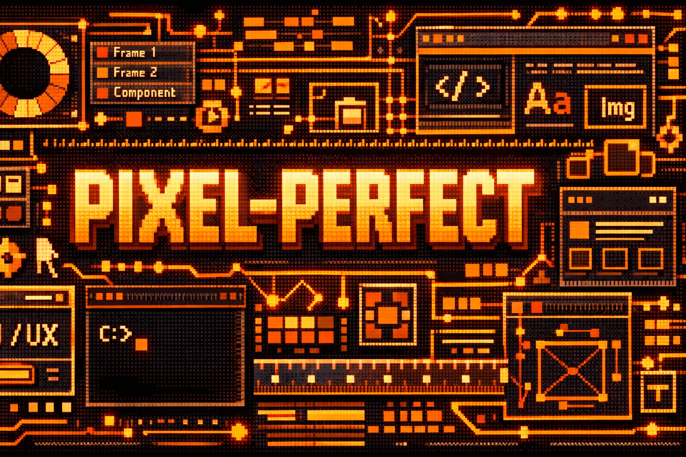

<p align="center">
  
</p>

# pixel-perfect

A Claude Code plugin that orchestrates a 7-phase build process for turning product requirements into real, running UI code sandboxed in Storybook. Supports web (React, Next.js, Vite) and mobile (React Native, Expo).

---

## Why Process Orchestration?

AI can write code. What it can't do on its own is follow a disciplined build process. Without structure, you get components built before the goal is clear, screens composed before atoms exist, and integration attempted before anything renders.

pixel-perfect enforces the process. It doesn't generate intermediate artifacts or mockup files -- it ensures you define your goal before picking tools, pick tools before scaffolding, build atoms before composing screens, and verify each phase before advancing to the next.

**The output is real code in your project's source tree.** Not YAML descriptions. Not HTML mockups. Actual components, screens, and navigation — all viewable in Storybook as sandboxed views.

---

## The 7-Phase Process

```
Phase 1: DISCOVER     Define goal, vibe, direction
Phase 2: TARGET       Define platforms + framework + style + components
Phase 3: EQUIP        Confirm tool selections, validate adapters
Phase 4: SCAFFOLD     Set up project, theme, design token stories
Phase 5: ATOMS        Build + verify individual components
Phase 6: COMPOSE      Assemble components into screens
Phase 7: INTEGRATE    Wire navigation, state, data
```

Each phase has a **gate** that must pass before you proceed. The plugin tracks state in `design/manifest.json` and blocks forward progress until gates clear.

Every command iteratively builds the UI system as real code — and finally when screens are composed, those are the sandboxed views in Storybook.

---

## Quick Start

### Installation

```
/plugin marketplace add https://github.com/hackerpug-ai/pixel-perfect
/plugin install pixel-perfect@pixel-perfect
```

### First Project

```bash
# 1. Set up your project (phases 1-3)
/pixel-perfect:init

# 2. Scaffold tools, theme, token stories (phase 4)
/pixel-perfect:scaffold

# 3. Build components and screens (phases 5-7)
/pixel-perfect:build

# Check progress anytime
/pixel-perfect:status
```

Init walks you through:
1. **Where are your requirements?** (auto-detects PRD.md)
2. **What's the goal?** (one sentence)
3. **What's the design vibe?** (clean, bold, playful, etc.)
4. **What platforms?** (web-desktop, web-mobile, mobile-ios, mobile-android)
5. **What framework?** (React, Next.js, Vite, React Native, Expo, or provide docs URL)
6. **What style system?** (Tailwind, NativeWind, CSS Modules, or provide docs URL)
7. **What component library?** (shadcn, Paper, Mantine, none, or provide docs URL)

The UI library is completely flexible — use whatever you want or build from scratch. pixel-perfect uses `AskUserQuestion` to follow your lead.

---

## Storybook as the Sandbox

Storybook is the universal sandbox for all platforms. Every component, design token, and screen gets a Storybook story.

### Mobile Projects: Native On-Device Storybook

For React Native/Expo projects, components render in **native on-device Storybook** (`@storybook/react-native`). This provides:
- True native rendering in iOS Simulator / Android Emulator
- No polyfills or web approximations
- Direct launch via `pnpm storybook` (opens Storybook immediately)

The scaffold phase creates a custom entry point (`index.js`) that conditionally switches between Storybook and your app based on the `EXPO_PUBLIC_STORYBOOK_ENABLED` environment variable.

### Web Projects: Browser-Based Storybook

For web projects (React, Next.js, Vite), components render in browser-based Storybook at `http://localhost:6006`.

### Storybook Sidebar Organization

```
Design System/          ← Token reference stories (scaffold phase)
  Colors
  Typography
  Spacing
  Icons
Components/             ← Atomic components (atoms phase)
  StatusBadge
  JobCard
  ActionButton
Screens/                ← Composed screens (compose phase)
  TodayFeed
  JobDetail
```

### Controls

Every component prop is wired to Storybook controls via `argTypes`. This makes every component interactive — you can tweak props directly in the browser.

---

## Commands

| Command | Phases | What It Does |
|---------|--------|-------------|
| `/pixel-perfect:init` | 1-3 | DISCOVER goal + vibe, TARGET platforms + framework + tools, EQUIP |
| `/pixel-perfect:scaffold` | 4 | Install tools, create theme, generate design token stories, verify hello-world |
| `/pixel-perfect:build` | 5-7 | Build atoms, compose screens, wire integration |
| `/pixel-perfect:verify` | any | Run gate checks for current phase |
| `/pixel-perfect:status` | any | Show phase progress, controls coverage, and component tracking |
| `/pixel-perfect:research` | any | Research design patterns and competitors |
| `/pixel-perfect:refine` | 5+ | Iterate on components/screens with feedback |

### Command Flow

```
research (optional)
    |
    v
  init  -->  scaffold  -->  build  -->  verify
  (1-3)      (4)           (5-7)       (gates)
                              |
                              v
                           refine (iterate)
```

---

## Adapter System

Adapters are reference docs that teach the AI how to scaffold, build, and verify for specific tools. They're loaded based on the user's choices during init. The commands themselves are tool-agnostic.

| Category | What It Controls | Loaded When |
|----------|-----------------|-------------|
| **Style** | Visual styling | User selects a style system |
| **Components** | UI component library | User selects a component library |
| **Sandbox** | Preview environment | Always (Storybook) |
| **Polyfill** | Web compatibility layer | Mobile projects (react-native-web) |

### Included Adapters

| Adapter | Category | Platforms |
|---------|----------|-----------|
| Tailwind | style | web, mobile (NativeWind) |
| shadcn/ui | components | web |
| React Native Reusables | components | mobile |
| React Native Paper | components | mobile |
| Storybook | sandbox | web |
| Storybook Native | sandbox | mobile (on-device) |
| React Native Web | polyfill | mobile (for web Storybook) |
| Generic | fallback | all |

### Stack Examples

```
Web:     {style} + {components} + Storybook
Mobile:  {style} + {components} + Storybook Native
Custom:  Any style + any components + Storybook
Minimal: Generic (process enforcement only)
```

Style and component libraries are user-selected during init (or auto-detected from `package.json`).

No specific UI library is required. Users can select "None" or "Other" with a docs URL, and the AI adapts.

---

## The Manifest

`design/manifest.json` is the single source of truth for process state:

```json
{
  "version": "4.0",
  "created": "2026-03-01",
  "goal": "Field service management app for HVAC technicians",
  "vibe": "clean, professional, high-contrast for outdoor use",
  "spec": "PRD.md",
  "platforms": ["mobile-ios", "mobile-android"],
  "tools": {
    "framework": "expo",
    "style": "nativewind",          // User-selected or auto-detected
    "components": "react-native-paper",  // User-selected
    "sandbox": "storybook"          // Auto-selected based on platform
  },
  "phase": "atoms",
  "gates": {
    "discover": "passed",
    "target": "passed",
    "equip": "passed",
    "scaffold": "passed",
    "atoms": "in-progress",
    "compose": "pending",
    "integrate": "pending"
  },
  "atoms": [
    {
      "name": "StatusBadge",
      "file": "src/components/StatusBadge.tsx",
      "story": "src/components/StatusBadge.stories.tsx",
      "status": "verified",
      "controls": true
    }
  ],
  "screens": [
    {
      "name": "TodayFeed",
      "file": "src/screens/TodayFeed.tsx",
      "story": "src/screens/TodayFeed.stories.tsx",
      "status": "pending",
      "atoms": ["StatusBadge", "JobCard", "DateChip", "SectionHeader"]
    }
  ]
}
```

---

## frontend-design Integration

pixel-perfect handles the **process**. The optional `frontend-design` plugin handles **aesthetics**.

When frontend-design is installed:
- **Scaffold**: Vibe is translated into concrete font pairings, color palettes, and motion philosophy
- **Atoms**: Components get distinctive typography, intentional color hierarchy, and considered motion
- **Compose**: Screens get spatial composition rules -- asymmetry, visual flow, intentional negative space
- **Verify**: Gate checks include aesthetic review, not just "does it render"

When frontend-design is NOT installed:
- Process gates still enforce (files exist, tests pass, theme is used)
- Theme generation uses keyword-to-value mapping (functional but potentially generic)
- A warning is shown recommending the plugin

---

## Auto-Activating Skill

When you work in a project that has `design/manifest.json`, the **process-context** skill auto-activates. Even without running pixel-perfect commands explicitly, the AI will:

- Know the current build phase
- Follow adapter conventions for the chosen tools
- Use theme tokens instead of hardcoded values
- Wire all props to Storybook controls
- Respect gate requirements before advancing phases

---

## Documentation

- [Adapter System](docs/adapters/README.md) - How adapters work and compose
- [Storybook Conventions](docs/storybook-conventions.md) - Controls, token stories, organization
- [Design Systems](docs/design-systems/README.md) - Supported design system references
- [Icon Libraries](docs/icon-libraries/README.md) - Supported icon library references

---

## Migration from v2

v4 is a clean break from v2. There is no incremental migration path.

- **v2 users**: Stay on the v2 git tag. Your YAML artifacts remain valid.
- **v4+**: Starts fresh with the 7-phase process. Real code is the artifact, Storybook is the sandbox.
- **Research**: `/pixel-perfect:research` output is compatible with both versions.

---

## Requirements

- Claude Code with plugin support
- A project directory with requirements (PRD.md or similar)

---

## License

MIT

---

*The best mockup of a component is the component. Stop pointing at the moon -- go there.*
