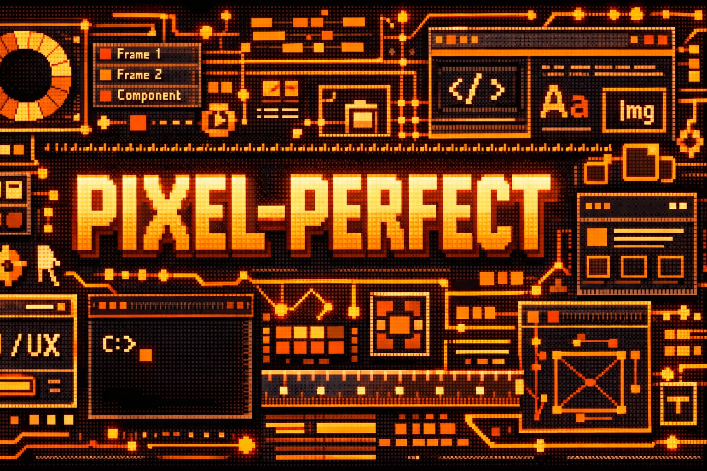

<p align="center">
  
</p>

# pixel-perfect

A version-locked plugin for Claude Code, Codex, Cursor, Grok, and OpenCode that generates and maintains a **high-fidelity production design system** — semantic tokens, atoms, molecules, organisms, screens — as real code in your target framework, browsable in a **native sandbox** it builds from scratch.

It exists to close one gap: the one between a beautiful AI-generated design and UI code you can actually ship.

---

## The Gap

AI has gotten very good at producing designs. Ask for a dashboard and you get a gorgeous one — a Figma frame, an HTML export, a screenshot, an image.

None of it is your product. Someone still has to read that picture and write the code, and the translation is where the design dies. Spacing gets eyeballed. Colors get hardcoded. The same card is re-implemented four times with four different paddings. Six weeks later nothing on screen matches what was approved, and there is no way to say what "correct" would even mean — because there was never a system, only a picture of one.

The generation half is solved. The **systematization** half is not, and that is the half that decides whether a design survives contact with a codebase.

pixel-perfect makes the design system the artifact instead of the picture.

## Atomic Design as the Execution Order

Atomic design here is not a diagram in a slide deck. It is the order the work happens in, and the order the gates fire in:

**tokens → atoms → molecules → organisms → screens**

Every level is real code in your framework. Every component gets a sandbox story with each prop wired to a live control. Every level has a gate that must pass before the next one starts, so a screen is never built on an atom that does not render.

That ordering is what makes the output a *system* rather than a pile of components. Nothing above a level can drift from it: change a token and it propagates; change an atom and every molecule and screen composing it is re-verified. A styling contract makes it stricter still — the declared style system is enforced by a deterministic gate, so a build cannot quietly invent a parallel one.

## Generating Is the Easy Part; Maintaining Is the Point

A design system that is generated once and then hand-edited is just a slower way to arrive at drift. `design/manifest.json` holds the state — what exists, what is verified, which gates have passed, which library each component wraps and why. Refinement flows back through the same levels with the same gates, so an iteration re-verifies what it touched instead of leaving it to rot.

## Designs Are Inputs, Not Deliverables

Bringing a design *in* is a first-class path, not a compromise. Point `design-deconstruct` at a URL, a screenshot, an HTML export, a competitor's app, or a written concept, and it extracts a token-governed atomic system from it — semantic tokens plus atom, molecule, organism, and view mockups. Those become **targets** the real components are built to match, pixel for pixel.

The mockup is a precise reference spec that AI reads perfectly. It is never what ships. The components in your framework's sandbox supersede it.

## Why a Sandbox Makes This Work

The unlock is the **sandbox** — a small component browser that renders each piece in isolation, themed, with its props exposed. It is what turns "a design system exists" from a claim into something you can look at.

Storybook is one web implementation of that idea, not the idea itself. An AI agent can generate one from scratch in *any* framework — React, SvelteKit, Expo, GPUI, Ratatui, SwiftUI — which is why every stack gets one here, not just the web.

---

## The 7-Phase Process

| Phase | What Happens | Gate Checks |
|-------|--------------|-------------|
| **DISCOVER** | Define goal + vibe from PRD | Goal statement exists, vibe captured |
| **TARGET** | Select platforms + framework | Platform/framework declared |
| **EQUIP** | Select style + component libraries | Adapters validated |
| **SCAFFOLD** | Install tools, create theme, generate token stories | Theme renders, sandbox runs |
| **ATOMS** | Build individual components | Each component has story + controls |
| **MOLECULES** | Build functional atom compositions (optional) | Each molecule has story + state scenarios |
| **ORGANISMS** | Build complex stateful compositions (optional) | Each organism has story + state scenarios |
| **COMPOSE** | Assemble screens from organisms, molecules, atoms | Screens render with real data shapes |
| **INTEGRATE** | Wire navigation + state | App navigates, state persists |

Each phase has a **gate** that must pass before you proceed. The plugin tracks state in `design/manifest.json` and blocks forward progress until gates clear.

---

## Quick Start

Version 7.4.0 projects the same runtime into all five harnesses.

### Claude Code

```text
/plugin marketplace add hackerpug-ai/pixel-perfect
/plugin install pixel-perfect@pixel-perfect
```

Invoke capabilities as `/pixel-perfect:init`, `/pixel-perfect:build`, and so on. Upgrade with:

```text
/plugin marketplace update pixel-perfect
/plugin update pixel-perfect@pixel-perfect
```

### Codex

```bash
codex plugin marketplace add hackerpug-ai/pixel-perfect
codex plugin add pixel-perfect@pixel-perfect
```

Invoke capabilities as `$pixel-perfect:init`, `$pixel-perfect:build`, and so on. Upgrade with:

```bash
codex plugin marketplace upgrade pixel-perfect
codex plugin add pixel-perfect@pixel-perfect
```

If the older personal installation is enabled, remove it before installing the Git marketplace version:

```bash
codex plugin remove pixel-perfect@personal
codex plugin add pixel-perfect@pixel-perfect
```

Keep the personal marketplace itself if it contains other plugins. `codex plugin list` should show only one installed Pixel Perfect source; two enabled sources create duplicate `$pixel-perfect:*` namespaces.

### Cursor

Cursor loads local plugins from `~/.cursor/plugins/local/`. **Copy** the package (do not symlink — Cursor has known failures loading symlinked local plugins):

```bash
git clone --branch v7.4.0 --depth 1 https://github.com/hackerpug-ai/pixel-perfect.git /tmp/pixel-perfect
mkdir -p ~/.cursor/plugins/local
rm -rf ~/.cursor/plugins/local/pixel-perfect
cp -R /tmp/pixel-perfect/plugins/pixel-perfect ~/.cursor/plugins/local/pixel-perfect
```

Reload Cursor (Command Palette → “Developer: Reload Window”). Invoke capabilities as slash commands (`/init`, `/build`, `/status`, …) from the installed plugin. Skills under `skills/` are also declared for convention discovery.

To upgrade, check out a newer `v*` tag in the clone and re-copy into `~/.cursor/plugins/local/pixel-perfect`. Marketplace submission at [cursor.com/marketplace/publish](https://cursor.com/marketplace/publish) is a separate manual step when you are ready — the manifests in this repo are submission-ready.

### Grok

Install Pixel Perfect through the Claude marketplace steps above, then open Grok's `/plugins` extension view and enable it if needed. Grok natively reads Claude Code marketplaces and plugins, so it uses the Claude manifest and marketplace version; there is intentionally no second Grok catalog or version field.

Invoke capabilities as `/pixel-perfect:init`, `/pixel-perfect:build`, and so on. Upgrading the Claude marketplace installation upgrades the version Grok consumes.

### OpenCode

OpenCode consumes the tagged Git checkout and its versioned adapter package. From the target project:

```bash
git clone --branch v7.1.0 --depth 1 https://github.com/hackerpug-ai/pixel-perfect.git .pixel-perfect
mkdir -p .opencode
ln -s ../.pixel-perfect/plugins/pixel-perfect/.opencode/commands .opencode/commands
ln -s ../.pixel-perfect/plugins/pixel-perfect/.opencode/skills .opencode/skills
```

Invoke capabilities as `/init`, `/build`, `/status`, and so on. To upgrade to a later release, fetch tags in `.pixel-perfect`, check out the desired `v<version>` tag, and restart OpenCode. The Pixel Perfect product version is in `plugins/pixel-perfect/.opencode/package.json`; the `@opencode-ai/plugin` dependency version is independent.

### First Project

```bash
# 0. (Optional) Start from an existing design instead of a blank PRD
/pixel-perfect:design-deconstruct https://example.com   # Claude Code or Grok
# $pixel-perfect:design-deconstruct https://example.com # Codex
# /design-deconstruct https://example.com               # OpenCode or Cursor

# 1. Set up your project (phases 1-3)
/pixel-perfect:init

# 2. Scaffold tools, theme, token stories (phase 4)
/pixel-perfect:scaffold

# 3. Build components and screens (phases 5-7)
/pixel-perfect:build

# Check progress anytime
/pixel-perfect:status
```

> **OpenCode users**: commands are available without the `pixel-perfect:` prefix (e.g., `/init`, `/build`, `/status`).

> **Cursor users**: slash commands from the local plugin use the short form (e.g., `/init`, `/build`, `/status`).

> **Codex users**: replace the leading slash form with `$pixel-perfect:<name>`.

Init walks you through:
1. **Where are your requirements?** (auto-detects PRD.md)
2. **What's the goal?** (one sentence)
3. **What's the design vibe?** (clean, bold, playful, etc.)
4. **What platforms?** (web-desktop, web-mobile, mobile-ios, mobile-android)
5. **What framework?** (React, Next.js, Vite, SvelteKit, React Native, Expo, or provide docs URL)
6. **What style system?** (Tailwind, NativeWind, CSS Modules, or provide docs URL)
7. **What component library?** (shadcn, shadcn-svelte, Bits UI, Skeleton, Paper, Mantine, none, or provide docs URL)

The UI library is completely flexible — use whatever you want or build from scratch. Pixel Perfect uses each harness's native input mechanism to follow your lead.

---

## The Sandbox — a spec, not a tool

A **sandbox** is just a component browser: it catalogs your components by layer and renders each one in isolation, themed. Storybook is *one* implementation of that idea (for the web) — not the idea. So pixel-perfect treats the sandbox as a **spec** ([`plugins/pixel-perfect/docs/sandbox-spec.md`](plugins/pixel-perfect/docs/sandbox-spec.md)) and, by default, **builds one from scratch in your target framework** — rendering the *real* components, nothing extra to install. An off-the-shelf tool is used only if you ask.

The spec is ~7 small pieces (a layer-keyed story registry · isolated render · a two-pane navigator · token codegen from `theme.*.json` · a run command · pixel-target refs). It's derived from two real, running sandboxes built from scratch in Rust — a GPUI desktop one and a Ratatui TUI one — the same concept in totally different paradigms.

### Why custom (v6 default)

**Storybook is great — for web projects that want Storybook.** But pixel-perfect builds UI in *any* framework: React, SvelteKit, React Native, Expo, GPUI, Ratatui, SwiftUI. Shoehorning all of those into Storybook means fighting Storybook — native-web shimming, addon incompatibilities, version conflicts, and an entire toolchain that doesn't apply outside a browser.

The agentic development model changes the calculus. An AI agent can generate a sandbox from scratch in ~60 lines — a registry + a two-pane shell + token codegen + a run command — *in whatever language and framework you're actually using*. That's cheaper than installing, configuring, and maintaining Storybook in a project where it's a poor fit.

**Why this works better cross-platform:**

| Concern | Storybook | Custom sandbox (v6 default) |
|---------|-----------|----------------------------|
| React web | ✅ native fit | ✅ tiny Vite browser, same result |
| SvelteKit | ⚠️ needs adapter, some rough edges | ✅ generated in Svelte, native |
| React Native / Expo | ⚠️ web shimming required | ✅ runs on-device in your framework |
| TUI (Ratatui / Bubbletea) | ❌ impossible | ✅ terminal-native, derived from real Rust sandboxes |
| Desktop (GPUI, SwiftUI) | ❌ impossible | ✅ platform-native |
| Maintenance burden | Storybook upgrades, addon compat, version pinning | ~60 lines you own; agent can regenerate anytime |
| Install footprint | ~200 deps, 30s+ cold start | ~0 deps, instant |

The agent **generates the sandbox during scaffold** — it's not a manual step. The spec (`plugins/pixel-perfect/docs/sandbox-spec.md`) is small and stable; the implementation varies by framework. Two real sandboxes (GPUI + Ratatui) prove the spec works across entirely different rendering paradigms.

Storybook remains a **first-class opt-in** for web projects that want it. Set `"sandbox": "storybook"` in the manifest and the scaffold step installs and configures it normally. But it's no longer the default — because the default should work for *every* platform.

| `tools.sandbox` | What you get | Launch |
|-----------------|-------------|--------|
| **`custom`** (default) | a native component browser generated in your framework | `npm run sandbox` / `make sandbox` |
| `storybook` | off-the-shelf Storybook (web) | `pnpm storybook` → localhost:6006 |
| `storybook-native` | on-device Storybook (RN/Expo) | `pnpm storybook` → simulator |
| `tui-sandbox` | terminal browser (experimental) | `tsbx dev` |

> **v6 (breaking):** the default sandbox is now `custom`, not Storybook. Existing projects that want to keep Storybook: set `"sandbox": "storybook"` under the platform's `tools` in `design/manifest.json`.

The scaffold phase generates the sandbox and sets everything up. Run `npm run sandbox` (or `make sandbox` / `pnpm storybook` if you opted into Storybook) and start building.

### Sidebar Organization

```
Design System/          ← Token reference stories (scaffold phase)
  Colors
  Typography
  Spacing
  Icons
Components/             ← Atomic components (atoms phase)
Molecules/               ← Molecule compositions (molecules phase, optional)
Organisms/               ← Complex stateful compositions (organisms phase, optional)
Screens/                ← Composed screens (compose phase)
  TodayFeed
  JobDetail
```

### Controls

Every component prop is wired to sandbox controls (`argTypes` in Storybook; labeled variants in a custom sandbox). This makes every component interactive — you can tweak props directly in the browser or terminal.

---

## Commands

| Command | Phases | What It Does |
|---------|--------|-------------|
| `/pixel-perfect:wireframe` | 0 (optional) | Low-fi: ASCII wireframes from plans/targets into `design/wireframes/` — a pre-step to design-deconstruct |
| `/pixel-perfect:design-deconstruct` | 0 (optional) | Deconstruct existing UI (code, URL, screenshot, concept) into token-governed HTML mockups that seed the build |
| `/pixel-perfect:init` | 1-3 | DISCOVER goal + vibe, TARGET platforms + framework + tools, EQUIP |
| `/pixel-perfect:scaffold` | 4 | Install tools, create theme, generate design token stories, verify hello-world |
| `/pixel-perfect:build` | 5-7 | Build atoms, compose screens, wire integration |
| `/pixel-perfect:verify` | any | Run gate checks for current phase |
| `/pixel-perfect:status` | any | Show phase progress, controls coverage, and component tracking |
| `/pixel-perfect:research` | any | Research design patterns, competitors, and ecosystem libraries (`--libraries`) |
| `/pixel-perfect:refine` | 5+ | Iterate on components/screens with feedback |
| `/pixel-perfect:add-platform` | 1-3 | Add and equip another target platform without resetting existing platform progress |

### Command Flow

```
wireframe ─▶ design-deconstruct      research (optional)
(ASCII,      (HTML mockups,                 |
 optional)    optional)                     |
        \           \                       |
         v           v                      v
        init  ──▶  scaffold  ──▶  build  ──▶  verify
        (1-3)      (4)           (5-7)       (gates)
                                  |
                                  v
                               refine (iterate)
```

---

## Starting From Existing UI or Concepts

Not every project starts from a written PRD. If you already have a design — a competitor's site, an old app's components, a screenshot, a Claude Design export, or just a concept — run the optional **`design-deconstruct`** step first:

```
/pixel-perfect:design-deconstruct <source>   # code path, URL, image, HTML, or concept text
```

It normalizes the source into a concept HTML, then deconstructs it into a **token-governed atomic design system** under `design/system/` — semantic tokens plus atom / molecule / organism / view HTML mockups (with PNG references). Those outputs seed the rest of the process:

- the extracted **tokens** become the theme (`scaffold` reads `design/theme-seed.json`)
- the **inventory** pre-fills the atom / molecule / screen build lists
- each **view mockup** becomes a pixel-perfect *target* the real component is built to match

The deconstructed HTML is a precise, token-governed *reference spec* — clean markup the AI reads perfectly — not a lossy hand-drawn mock, and never the deliverable. The real components in your framework's native sandbox supersede it. The deconstruction engine ships with the plugin; it extracts every UI concept and token from your design into a governed system. Nothing extra to install.

### Wireframe first (the low-fi rung)

When you're starting from **plans** rather than existing UI, run `/pixel-perfect:wireframe` first. It turns a PRD / sprint plan / spec (or a one-line concept) into **ASCII box-drawing wireframes** in `design/wireframes/` — one per screen, desktop + mobile, annotated and mapped to the components they imply. No renderer, no pixels: it commits the *structure* (layout, IA, hierarchy, states) cheaply. That gives the full **fidelity ladder**:

> **wireframe** (ASCII, structure) → **mockup** (HTML, design-deconstruct / high-fi) → **component** (real, in your framework's native sandbox)

Each rung is a *target* the next is built to match. Wireframes feed `design-deconstruct` directly (`/pixel-perfect:design-deconstruct design/wireframes`) or seed `init` (it detects them and pre-fills your screen list).

---

## Adapter System

Adapters are reference docs that teach the AI how to scaffold, build, and verify for specific tools. They're loaded based on the user's choices during init. The commands themselves are tool-agnostic.

| Category | What It Controls | Loaded When |
|----------|-----------------|-------------|
| **Style** | Visual styling | User selects a style system |
| **Components** | UI component library | User selects a component library |
| **Sandbox** | Component browser | `custom` by default (Storybook opt-in) |

### Included Adapters

| Adapter | Category | Status |
|---------|----------|--------|
| SvelteKit | framework (web) | stable |
| Tailwind / NativeWind | style | stable |
| shadcn/ui | components (web) | stable |
| shadcn-svelte / Bits UI / Skeleton | components (Svelte) | stable |
| React Native Paper | components (mobile) | stable |
| Custom Sandbox | sandbox (**default**) | stable |
| Storybook / Storybook Native | sandbox (opt-in) | stable |
| tui-sandbox | sandbox (opt-in, TUI/CLI) | experimental |
| Lipgloss / Rich / Ink | style (TUI) | experimental |
| Bubbletea / Textual / Ink | components (TUI) | experimental |
| Generic | fallback | stable |

No specific library is required. Select "None" or "Other" with a docs URL, and the AI adapts.

---

## The Manifest

`design/manifest.json` is the single source of truth for process state:

```json
{
  "version": "4.0",
  "created": "2026-03-01",
  "goal": "Dashboard for monitoring real-time analytics",
  "vibe": "clean, data-dense, dark mode",
  "spec": "PRD.md",
  "ecosystemMode": "suggest",
  "platforms": ["web-desktop"],
  "tools": {
    "framework": "vite",
    "style": "tailwind",
    "components": "shadcn",
    "sandbox": "custom"
  },
  "phase": "atoms",
  "gates": {
    "discover": "passed",
    "target": "passed",
    "equip": "passed",
    "scaffold": "passed",
    "atoms": "in-progress",
    "compose": "pending",
    "integrate": "pending"
  },
  "atoms": [
    {
      "name": "StatusBadge",
      "file": "src/components/StatusBadge.tsx",
      "story": "src/components/StatusBadge.stories.tsx",
      "status": "verified",
      "controls": true
    },
    {
      "name": "DataTable",
      "file": "src/components/DataTable.tsx",
      "story": "src/components/DataTable.stories.tsx",
      "status": "verified",
      "controls": true,
      "ecosystemLib": {
        "package": "@tanstack/react-table",
        "version": "^8.20.0",
        "purpose": "Headless table logic",
        "vetting": {
          "score": "8/8",
          "researchDate": "2026-06-04"
        }
      }
    }
  ],
  "molecules": [],
  "organisms": [
    {
      "name": "DataTable",
      "file": "src/organisms/DataTable.tsx",
      "story": "src/organisms/DataTable.stories.tsx",
      "status": "verified",
      "molecules": ["SearchBar"],
      "atoms": ["Pagination", "TableRow"],
      "state": {
        "declared": [
          { "name": "sortColumn", "type": "string | null" },
          { "name": "sortDirection", "type": "'asc' | 'desc'" },
          { "name": "currentPage", "type": "number" }
        ],
        "scenarios": ["default-sort", "custom-sort", "page-2", "rows-selected", "empty"]
      }
    }
  ],
  "screens": [
    {
      "name": "TodayFeed",
      "route": "/today",
      "states": ["default", "empty", "loading"],
      "file": "src/screens/TodayFeed.tsx",
      "story": "src/screens/TodayFeed.stories.tsx",
      "status": "pending",
      "atoms": ["StatusBadge", "JobCard", "DateChip", "SectionHeader"],
      "molecules": ["JobRow"],
      "organisms": []
    }
  ]
}
```

---

## Design Execution

Pixel Perfect bundles one design contract for every harness. When the named `frontend-designer` agent is available, it executes that contract. Otherwise the primary agent executes the same contract directly. Pixel Perfect never substitutes a generic design subagent, and aesthetic review never replaces compilation, rendering, tests, or deterministic gates.

---

## Manifest-Aware Process Context

Unsupported `autoActivate` metadata is not used. Every public entry adapter checks for `design/manifest.json` or legacy `design/manifest.yaml` and explicitly loads the bundled **process-context** skill before executing. It then:

- Knows the current build phase
- Follows adapter conventions for the chosen tools
- Uses theme tokens instead of hardcoded values
- Wires all props to sandbox controls (Storybook `argTypes` or custom sandbox variants)
- Respects gate requirements before advancing phases

## Releasing

`plugin-release.json` is the only manually selected product version. Product version lockstep covers Claude, Codex, Cursor, Grok (via Claude marketplace), and OpenCode. All releases must use:

```bash
node scripts/release.mjs prepare 7.4.0
node scripts/release.mjs verify 7.4.0
node scripts/release.mjs publish 7.4.0
```

Direct version edits, hand-created tags, and manual GitHub releases are unsupported. `prepare` synchronizes product-version fields (including Cursor manifest + marketplace metadata) without changing OpenCode dependency versions. `verify` is read-only. `publish` requires clean `main`, `HEAD === origin/main`, a matching non-empty changelog section, valid package content, an absent tag, and authenticated `gh` before creating an annotated tag or GitHub release.

---

## Documentation

- [Adapter System](plugins/pixel-perfect/docs/adapters/README.md) - How adapters work and compose
- [State Patterns](plugins/pixel-perfect/docs/state-patterns.md) - Framework-by-framework state patterns for molecules and organisms
- [Storybook Conventions](plugins/pixel-perfect/docs/storybook-conventions.md) - Controls, token stories, organization (Storybook opt-in)
- [Sandbox Spec](plugins/pixel-perfect/docs/sandbox-spec.md) - The seven-piece spec every sandbox implements (custom default)
- [Library Vetting Rubric](plugins/pixel-perfect/docs/library-vetting-rubric.md) - 8-criteria rubric for evaluating ecosystem libraries
- [Ecosystem Patterns](plugins/pixel-perfect/docs/ecosystem-patterns.md) - Pattern map, search guardrails, and reputational scoring for library recommendations
- [Design Systems](plugins/pixel-perfect/docs/design-systems/README.md) - Supported design system references
- [Icon Libraries](plugins/pixel-perfect/docs/icon-libraries/README.md) - Supported icon library references

---

## Migration from v2

v4 is a clean break from v2. There is no incremental migration path.

- **v2 users**: Stay on the v2 git tag. Your YAML artifacts remain valid.
- **v4+**: Starts fresh with the 7-phase process. Real code is the artifact, the sandbox is generated natively in your framework.
- **Research**: `/pixel-perfect:research` output is compatible with both versions.

---

## Requirements

- **Claude Code**, **Codex**, **Cursor**, or **Grok** with plugin support, or **OpenCode** with command/skill support
- A project directory with requirements (PRD.md or similar)

---

## License

MIT

---

*The best mockup of a component is the component. Stop pointing at the moon -- go there.*
