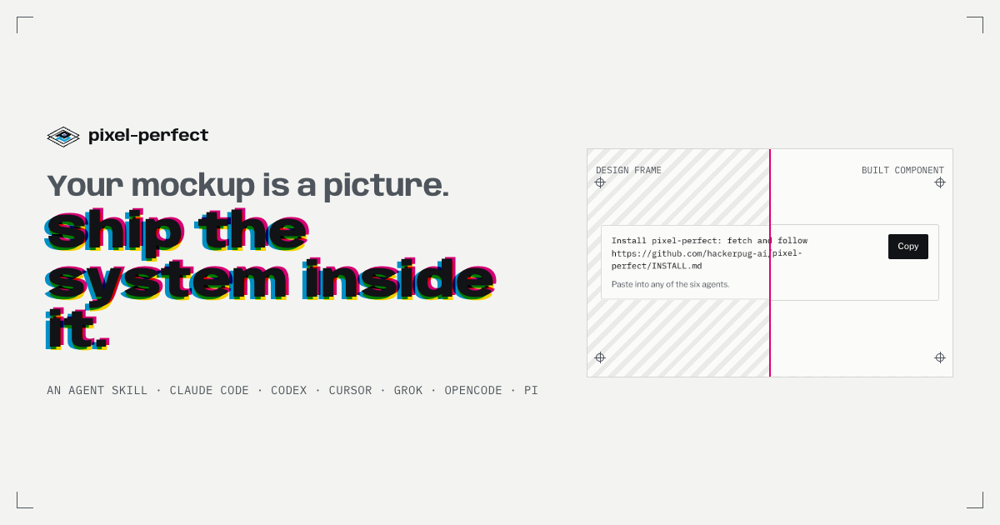

<p align="center"><a href="https://hackerpug-ai.github.io/pixel-perfect/"></a></p>

# pixel-perfect

An agent skill for Claude Code, Codex, Cursor, Grok, OpenCode, and Pi.

pixel-perfect is an agent skill that reads every frame of a high-fidelity mockup and turns it into real components in your framework: tokens, atoms, molecules, organisms, and screens. Each layer is checked against the frames it came from before the next layer starts. After that, every new screen, from a mock or a single sentence, is built from the parts you already have.

```text
Install pixel-perfect: fetch and follow https://raw.githubusercontent.com/hackerpug-ai/pixel-perfect/main/INSTALL.md
```

Paste into any of the six agents. Prefer your agent's own commands? [See every install option](#install).

[Why](#why) · [Build it](#build) · [Grow it](#grow) · [Install](#install) · [FAQ](#faq) · [Site ↗](https://hackerpug-ai.github.io/pixel-perfect/)

MIT · by Justin Rich · Works in six agents · Frameworks: SvelteKit, React, Expo, SwiftUI, GPUI, Ratatui, and any stack with a docs URL

<a name="why"></a>
## Designs die in translation.

You paste a screenshot into your agent and say "build this." The first screen comes out well. The second screen's card has different padding, a gray that isn't in the design, and a button that's almost the same. Nobody wrote down which colors are tokens, so the agent guessed.

Six weeks later there are four slightly different cards and no way to say which one is correct. The mockup is still right. The code drifted, one screen at a time.

**Your design survives your codebase.**

- **Consistency through composability.** Every screen is assembled from the same parts, so one card can't quietly become four.
- **Make it real.** No mockup step, no spec format, no throwaway files. The design is the reference, and the code in your repository is the deliverable.
- **Rapid iteration.** Add a screen with one sentence, and it's built from the parts you already have. Change a token and it flows everywhere. Change a component and everything built on it re-checks.
- **Language agnostic.** Works in whatever UI stack you use. Storybook if you want it, a native sandbox if you don't.

<a name="build"></a>
## From mockup to system in four commands.

Point it at the design, scaffold a sandbox, build the layers, and read the report. Each layer is checked against its frames before the next one starts, so the report is the proof.

`TOKENS · ATOMS · MOLECULES · ORGANISMS · SCREENS`

One mockup, separated into five layers. Each layer is built and checked before the next.

1. **Read the design**

   ```text
   /pixel-perfect:init my designs are in design/deck.html
   ```

   Finds the frames, detects your framework, writes the manifest.

   `design/manifest.json` (excerpt), from the landing site's own build:

   ```text
   {
     "spec": "../.spec/prds/landing/strategy.md",
     "references": [6 design files],
     "framework": "sveltekit",
     "sandbox": "storybook",
     "platforms": ["web-desktop", "web-mobile"]
   ```

2. **Scaffold the sandbox**

   ```text
   /pixel-perfect:scaffold
   ```

   A component browser in your framework, with the token stories already in it.

   Terminal output, from the landing site's own build:

   ```text
   created  src/app.css
   created  .storybook/main.ts
   created  src/lib/design-system/Colors.stories.svelte
   created  src/lib/design-system/Typography.stories.svelte
   sandbox  http://localhost:6006
   ```

3. **Build the layers**

   ```text
   /pixel-perfect:build
   ```

   Writes the inventory first. Every item names the frames that justify it and the parts it composes. Then it builds, bottom layer first.

   `design/inventory.json` (excerpt), from the landing site's own build:

   ```text
   "atoms": [
     { "name": "Button",
       "appears_on": ["pixel-perfect-landing-dc/01", … 17 frames] }, …
   "molecules": [
     { "name": "CopyBlock",
       "composes": ["InlineCode", "Button"],
       "appears_on": ["pixel-perfect-landing-dc/01", … 10 frames] }, …
   ```

4. **Check the proof**

   ```text
   /pixel-perfect:status
   ```

   A gate is a check of one layer against its frames. It runs once per layer, so the next layer starts from parts that already match.

   `status` output (excerpt), from the landing site's own build:

   ```text
   tokens    gate passed  25 colours
   atoms     gate passed  22 components
   molecules gate passed  18 components
   organisms gate passed  15 components
   screens   building
   ```

| Tokens | Minutes | Frames | Gates | Components |
|--------|---------|--------|-------|------------|
| 10.0M | 326 | 22 | 34 | 55 |

Measured on the landing site's own build. Tokens counts new tokens; see the [FAQ](#faq).

Recorded run, sped up: build, then status. 13 minutes in 66 seconds. [Watch it on the site](https://hackerpug-ai.github.io/pixel-perfect/#build).

No mockup yet? `wireframe` turns a PRD into wireframes that `build` reads the same way.

<a name="grow"></a>
## Your next screen starts from the parts you already have.

The system is the deliverable, so it keeps going. Describe a page, or drop in a new mock, and the agent reuses what exists before it invents anything.

```text
YOU    /pixel-perfect:evolve "add a changelog page"
AGENT  EVOLVE proved — add Changelog · SiteHeader+home · TouchList+inline code · check clean · 0 pre-existing goldens moved
       reuse 6 · new 1 · 0 captured components moved
```

This thread is the recorded run.

| Command | When | What it does |
|---------|------|--------------|
| `/pixel-perfect:evolve` | with a new mock | Sorts each element into reuse, variant, new, promote, or remove, with an orphan sweep for removals. Confirms once. Proves by re-capture. |
| `/pixel-perfect:refine` | with a token change | Change a token. Every component that uses it updates, and the gates confirm nothing else moved. |
| `/pixel-perfect:add-platform` | | The same system on a second platform, built from the same inventory. |

**It writes a `DESIGN.md` too.**

A plain document of your tokens and components, kept current on every build, so your other tools and your teammates read the same system.

```text
DESIGN.md · GENERATED · EXAMPLE
## tokens
color.ink       #111316
color.accent    #E0007A
space.4         16px
radius.sm       4px
## components
Button    primary, secondary
PlanCard  composes Heading, Price, Button
Header    composes Logo, NavLink
```

<a name="install"></a>
## Install it in your agent.

Read the skill before you install it. It's a folder of markdown and scripts in the open. You need one of the six agents, a project in your framework, and your design as files or a URL. HTML and URL designs also need Chrome, which renders their frames.

Run the commands for your agent in a terminal.

**Claude Code**

```bash
claude plugin marketplace add hackerpug-ai/pixel-perfect
claude plugin install pixel-perfect@pixel-perfect
```

**Codex**

```bash
codex plugin marketplace add hackerpug-ai/pixel-perfect
codex plugin add pixel-perfect@pixel-perfect
```

**Grok.** Skip this if the Claude Code install is on the same machine, because Grok already reads it. `--trust` skips Grok's confirmation prompt.

```bash
grok plugin install hackerpug-ai/pixel-perfect#plugins/pixel-perfect --trust
```

**Cursor, OpenCode, and Pi** install from the newest release tag. Follow the steps for [Cursor](INSTALL.md#cursor), [OpenCode](INSTALL.md#opencode), or [Pi](INSTALL.md#pi). [`INSTALL.md`](INSTALL.md) also has upgrade and uninstall steps for every agent.

Next: open a project that has your design and run `/pixel-perfect:init`.

| Agent | Run a command as |
|-------|------------------|
| Claude Code, Grok | `/pixel-perfect:init` |
| Codex | `$pixel-perfect:init` |
| Cursor, OpenCode | `/init` |
| Pi | `/skill:pixel-perfect-init` |

Releases are version-locked across all six agents. Every breaking release ships an upgrade guide. Upgrading from 7.x? Read the [8.0 guide](plugins/pixel-perfect/docs/UPGRADING-8.0.md). From 8.x? Read the [9.0 guide](plugins/pixel-perfect/docs/UPGRADING-9.0.md). Returning to a project you built earlier? Read [returning to a project](plugins/pixel-perfect/docs/RETURNING-PROJECT.md).

| What it touches | Items |
|-----------------|-------|
| READS | Your design files or URL · package.json and the framework config · DESIGN.md, if one exists |
| WRITES | Components in your source tree · Sandbox stories · `design/` and `DESIGN.md` |
| RUNS | Your package manager · A headless browser, for capture · Your existing lint and test scripts |

## Commands

The commands below use the Claude Code and Grok form, `/pixel-perfect:<name>`. Your agent's form is in the "Run a command as" table under [Install](#install).

**Build it**

| Command | What it does |
|---------|--------------|
| `/pixel-perfect:init` | Initialize a new UI project and record its goals, platforms, and toolchain. |
| `/pixel-perfect:scaffold` | Set up the selected framework, tokens, component sandbox, and capture tooling before building product components. |
| `/pixel-perfect:build` | Implement or resume the confirmed component and screen plan. |
| `/pixel-perfect:status` | Inspect current progress, reference freshness, unfinished refresh work, and the next appropriate command without changing project configuration. |
| `/pixel-perfect:verify` | Check implementation, reference fidelity, and affected behavior; record evidence and incomplete work. |

**Grow it**

| Command | What it does |
|---------|--------------|
| `/pixel-perfect:evolve` | Reconcile an existing UI system with updated designs or requirements, plan visual and inventory changes, and coordinate implementation and verification. |
| `/pixel-perfect:refine` | Apply a specific correction to named components, screens, or theme using feedback or a reference. |
| `/pixel-perfect:add-platform` | Add a target platform to an existing project while preserving its existing platform configuration and progress. |

**Before you build**

| Command | What it does |
|---------|--------------|
| `/pixel-perfect:wireframe` | Create low-fidelity layouts and state maps from requirements or concepts before implementation. |
| `/pixel-perfect:research` | Research UI patterns, products, or libraries and save findings for later design decisions. |
| `/pixel-perfect:assimilate` | Analyze new mockups or inspiration and propose additions to the design system. |

<a name="faq"></a>
## Questions

<details><summary>Why not just prompt my agent?</summary>

Prompting works for one screen and breaks on the second. The agent has no record of which values are tokens and which parts already exist, so each screen is a fresh guess. pixel-perfect writes that record down as code, then checks every new layer against the design before moving on.

</details>

<details><summary>What happens when the design changes?</summary>

Run `evolve` with the new mock. Each element is sorted into reuse, variant, new, promote, or remove, you confirm once, and a re-capture shows exactly which components moved.

</details>

<details><summary>How many tokens does it use?</summary>

The landing site's own build read a 22-frame design and used 10.0M new tokens across 326 active minutes, plus 444.4M tokens of cached context re-read between turns. Frames are read once and cached, so evolve and refine runs cost a fraction of the first build.

</details>

<details><summary>Does it work with my stack?</summary>

If your stack has a docs URL, yes. SvelteKit, React, Expo, SwiftUI, GPUI, and Ratatui have been built with it. Where Storybook doesn't run, it generates a native sandbox in your framework instead.

</details>

<details><summary>Will it lock me in?</summary>

No. The output is plain code in your repository plus a DESIGN.md. Delete the skill and everything it built still works, because nothing depends on it at runtime.

</details>

<details><summary>It's at version 9. Is it stable?</summary>

The command surface is stable and version-locked across all six agents. The major number counts breaking changes to the inventory format, and each one ships with an upgrade guide.

</details>

<details><summary>Don't gates make this slow?</summary>

They make the next step faster. A gate runs once per layer, so every layer is built on parts that already match, and later changes are cheap: change a token, every component that uses it updates, and the gates confirm nothing else moved.

</details>

<details><summary>How is this different from v0, Claude Design, or Figma's MCP?</summary>

Those produce the design. pixel-perfect starts where they stop: it takes their output as input and turns it into a component system in your repository that keeps growing with every screen.

</details>

## Docs

- [`INSTALL.md`](INSTALL.md): install, upgrade, and uninstall steps for all six agents.
- [`sandbox-spec.md`](plugins/pixel-perfect/docs/sandbox-spec.md): what a sandbox must do, and how pixel-perfect builds one in your framework.
- [`adapters/README.md`](plugins/pixel-perfect/docs/adapters/README.md): how adapters teach the agent your framework, styles, and component library.
- [`RETURNING-PROJECT.md`](plugins/pixel-perfect/docs/RETURNING-PROJECT.md): how to refresh a project you already built.
- [`REFRESH-CONTRACT.md`](plugins/pixel-perfect/docs/REFRESH-CONTRACT.md): the inputs, saved state, and evidence rules for `evolve --refresh`.
- [`plugins/pixel-perfect/docs/`](plugins/pixel-perfect/docs/): every other reference, including state patterns and Storybook conventions.

**Your next mockup has a system inside it.**

[Install pixel-perfect](#install) · [MIT](LICENSE) · [Changelog](CHANGELOG.md) · [Contributing](CONTRIBUTING.md) · [Issues](https://github.com/hackerpug-ai/pixel-perfect/issues)
