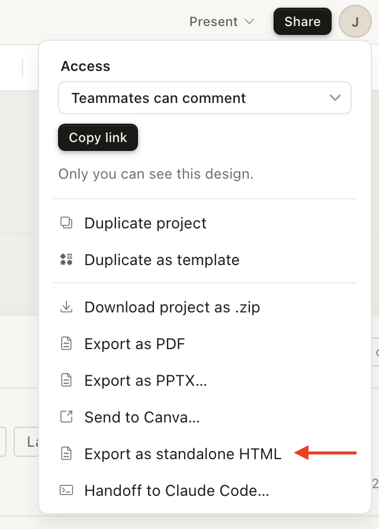

# deconstruct-engine (pixel-perfect)

Authoritative deconstruction engine for **`/pixel-perfect:design-deconstruct`**. Ships inside the pixel-perfect plugin as `skills/deconstruct-engine/`.

Reverse-engineers a Claude Design exported HTML (or other concept) into a token-governed atomic design system. Every mock ships **one file per theme** (`dark.html` + `light.html`, each with its own PDF + PNG); views are **state-split** into nested route folders and can be **driven by an external view inventory** with a deterministic coverage gate. Deterministic tooling owns token emission (with a live semantic ⇄ concept round-trip), theme-split, link depth, bundling, render, per-component processing, a Phase-0 concept preflight, a 3-axis audit (token-purity + link-resolution + render-sanity), and the **Design Review Browser**.

> **Do not use the standalone `design-deconstruct` skill** (`~/.claude/skills/design-deconstruct` or `brain/skills/design-deconstruct`). That copy is **deprecated**. Invoke via:
> ```
> /pixel-perfect:design-deconstruct <source>
> ```
> which always runs this engine.

## Getting started

Use the pixel-perfect command (preferred):

```
/pixel-perfect:design-deconstruct design/concepts/<name>.html
```

Direct engine invoke (advanced):

```
Skill("deconstruct-engine", "design/concepts/<name>.html --output design/system")
```
## Exporting from Claude Design

This skill works with a **standalone HTML export** — not the "handoff to Claude Code" link. The handoff link just gives an agent a URL with no structure; the standalone HTML contains the actual design markup this skill decomposes.

**To export:**

1. In Claude Design, click the **Share** button (top right)
2. Choose **Export as standalone HTML** (not "Share with Claude Code")

   

3. Save the file to your project — typically `.spec/design/concepts/<name>.html`

If your Claude Design project has **two decks** — a design-system deck (tokens, components) and a concepts deck (screen frames) — export both and pass the system deck via `--tokens-from` (see Usage). Phases 1–2 read the system deck; Phases 3–5 read the concepts deck.

## Why

Claude Design produces beautiful, high-fidelity HTML — but asking an agent to *reproduce* that design is rough. The standard prompt is thin:

```shell
Fetch this design file, read its readme, and implement the relevant aspects of the design. https://api.anthropic.com/v1/design/h/...?open_file=example.html
```

That's not enough context for an implementation agent. There are no tokens, no component boundaries, no variant inventory — just a monolithic HTML file.

This skill bridges the gap. It takes a standalone exported HTML from Claude Design and decomposes it into a structured atomic design system — from semantic tokens and themes up through atoms, molecules, organisms, and full pages. Each layer gets a documented README, a multi-variant preview, and rendered artifacts. The result is a design system an implementation agent can actually work with.

## What it does

This is an **iterative process**, not a one-shot command. Each time you export a concept from Claude Design, you run this skill against it. The system accumulates: tokens grow, new atoms and molecules are added, organisms and views are extended or updated. Re-running with an updated concept merges changes into the existing system rather than replacing it.

A single invocation first **preflights** the concept (a bundled export needs its inline JS bundler to settle before anything renders — the preflight fails closed on a blank capture and extracts per-frame reference PNGs), then decomposes it through five sequential phases:

1. **Tokens** — A two-tier system: Tier-1 concept primitives (the source's own keys, `--_`-prefixed) and Tier-2 role-named semantic aliases that reference them via `var()`. Emitted deterministically (`tokens.css` + theme JSON + `semantic-tokens.json` + a human `TOKEN-MAP.md`) with a verified round-trip — every non-derived Tier-2 dark value equals the source. Single-theme source → the other theme is derived and flagged.
2. **Atoms** — Indivisible components (buttons, inputs, tags, icons). Each gets a folder with a recipe README and a `dark.html`/`light.html` gallery (every variant × state side-by-side). New atoms are added; existing atoms get new variants if the concept introduces them.
3. **Molecules** — Compositions of 2+ atoms. Compose by class (via the generated `_lower.css`); never redefine atom styling.
4. **Organisms** — Page-section units (nav, feed entries, footers). Compose from molecules + atoms.
5. **Views** — Full pages built from organisms, **state-split** into nested route folders (one coherent mock per state), each with `dark.html`/`light.html` + desktop & mobile renders. With `--views-from`, an external route→state→variant inventory (e.g. a `routes.md` view directory) drives the tree and a deterministic coverage gate reports every variant as mocked, deferred-with-reason, or missing — a deck-driven run can pass every audit while silently covering a fraction of the product's real variants; the inventory closes that hole.

Every artifact references Tier-2 tokens. Nothing hardcodes colors, spacing, or typography; one theme + one state per file.

### Iterative workflow

1. Design a page in Claude Design, export the HTML
2. Run `/design-deconstruct concept.html` to build the initial system
3. Design another page or iterate on the same one, export again
4. Run `/design-deconstruct updated-concept.html` — the skill detects existing output and merges
5. Repeat until your design system covers all pages and states

## Usage

```
/design-deconstruct <concept-html-path>
/design-deconstruct <concept-html-path> --output <dir>
/design-deconstruct <concept-html-path> --tokens-from <system-deck.html>
/design-deconstruct <concept-html-path> --views-from <inventory.md>
/design-deconstruct <concept-html-path> --doctrine <constraints.md>
/design-deconstruct <concept-html-path> --parallel <N>
/design-deconstruct <concept-html-path> --fidelity
/design-deconstruct <concept-html-path> --resume-from <phase>
/design-deconstruct <concept-html-path> --force
```

| Flag | Purpose |
|------|---------|
| `--output <dir>` | Override output directory (default: `./.spec/design/system`) |
| `--tokens-from <html>` | Design-system deck for Phases 1–2 (tokens/atoms) while Phases 3–5 read the main concept |
| `--views-from <md>` | External route→state→variant inventory that drives Phase 5 + the coverage gate |
| `--doctrine <file>` | Project constraint file(s), injected verbatim into every subagent prompt; doctrine overrides the concept (repeatable) |
| `--parallel <N>` | Opt-in within-phase fan-out (default sequential); escapes resolve at a wave barrier |
| `--fidelity` | Advisory vision pass comparing each view mock to its preflight reference frame |
| `--resume-from <phase>` | Resume from a specific phase (`tokens`, `atoms`, `molecules`, `organisms`, `views`) |
| `--force` | Full regeneration; ignores existing output |

When existing output is detected, the skill presents a phase selector — choose which layers to regenerate. Upward dependencies cascade automatically (e.g., regenerating atoms also queues molecules, organisms, and views). Phases you don't select are preserved as-is.

## Output structure

```
.spec/design/system/
├── reference/
│   ├── concept-full.png      # preflight full render (proves the deck is live)
│   └── frame-NN.png          # per-frame references (DOM-rect crops, reading order)
├── tokens/
│   ├── build-tokens.mjs      # token synthesizer (subagent fills CONCEPT + SEMANTIC tables)
│   ├── tokens.css            # Tier-1 --_ primitives + Tier-2 aliases (via var())
│   ├── theme.dark.json  theme.light.json   # semantic layer resolved per theme
│   ├── theme.schema.json     # JSONSchema enforcing key parity
│   ├── semantic-tokens.json  # machine round-trip (semantic → concept)
│   └── TOKEN-MAP.md          # human bidirectional map (⚠ flags derived)
├── typography/
│   ├── fonts.css             # @font-face declarations
│   └── type-modules.css      # .type-h1, .type-body, etc.
├── atoms/  molecules/  organisms/
│   ├── _preview.css / _lower.css   # preview frame + generated lower-layer bundle
│   ├── README.md
│   └── {name}/
│       ├── README.md
│       ├── dark.html   dark.png   dark.pdf
│       └── light.html  light.png  light.pdf
├── views/
│   ├── _lower.css  README.md
│   ├── {single-state-route}/        dark.{html,png,pdf,-mobile.png}  light.{…}
│   └── {stateful-route}/
│       ├── _base/                   dark.{…} light.{…}      # base page
│       ├── {state}/                 dark.{…} light.{…}      # one mock per state
│       └── {surface}/{state}/       dark.{…} light.{…}      # multi-state → nested
├── browse/                   # Design Review Browser (human feedback surface)
│   ├── index.html  browse.css  browse.js
│   └── catalog.json          # generated by _build-catalog.mjs
├── _preflight.sh _head.mjs _split.mjs _build-bundle.mjs _render.sh
├── _process.mjs _audit.mjs _sanity.py _coverage.mjs _build-catalog.mjs
├── primitives/               # per-category PNG strips
├── tokens.html               # rendered primitives index (both themes)
└── manifest.json             # run metadata + coverage claims + audit trail
```

## Reviewing mocks (Design Review Browser)

After Phase 5, the tree is deep on purpose (one leaf per state). Do **not** click through
folders for feedback. Use the staged browser:

```bash
cd design/system                 # or your --output path
node _build-catalog.mjs          # refresh if you added leaves by hand
python3 -m http.server 8765
open http://localhost:8765/browse/
```

Keyboard: `j`/`k` next leaf · `d` theme · `p` pair · `i` live HTML · `o`/`n`/`b` status · `e` export notes.
Feedback stays in `localStorage` and exports as markdown for designer handoff.

## Quality bar

Every component artifact is verified against three deterministic axes (recursive) at each phase boundary — all three run inside one `_process.mjs` call per component:

- **Token purity** (`_audit.mjs`) — zero hex/rgb literals; zero raw typography numerics; zero raw px spacing (`var(--space-*)`); Tier-2 tokens only (no `--_` Tier-1 leaks)
- **Link resolution** (`_audit.mjs`) — every `<link>` stylesheet href resolves (depth computed by `_head.mjs`)
- **Render sanity** (`_sanity.py`) — every `dark.*` PNG reads dark, every `light.*` reads light (catches unstyled / wrong-theme renders)
- Plus: **no placeholder content**; **one theme + one state per file**; **composition purity** (compose lower layers by class via `_lower.css`, never redefine); the **token round-trip** (non-derived Tier-2 dark == source); and with `--views-from` the **coverage gate** (`_coverage.mjs` — every inventory variant mocked or deferred-with-reason, claims verified on disk).

The optional `--fidelity` pass is **advisory**: a vision comparison of each view mock against its reference frame, filed as findings — deliberate doctrine-driven divergence is expected, so it never gates.

Failures trigger a re-dispatch of the offending component's subagent with the violating lines quoted.

## Regeneration cascade

If a later phase discovers a missing variant at a lower layer, it emits a `VARIANT_REQUEST` (in its return envelope). The orchestrator:

1. Pauses the current phase (or queues to the wave barrier under `--parallel`)
2. Dispatches a targeted subagent to extend the lower-layer component (re-author its `_src.html` additively)
3. Runs `node _process.mjs {layer} {name}` (split + render + audit + sanity in one call) and rebuilds the consuming layers' `_lower.css`
4. Resumes the current phase

Cascades are hard-capped at 3 layers of recursion with cycle detection.

## Dependencies

- **`frontend-design:frontend-design`** — provides per-phase aesthetic briefing that steers each component's distinctive look
- **Headless Chrome** — required for PDF + PNG rendering (no fallback)

## Limitations (by design)

This skill does **not** produce runnable application code. It produces an agent-readable design system — HTML previews, token CSS, PNG snapshots, and README recipes.

The intended workflow is to point your planning and implementation agents at the output directory. They can read the PNG files as visual references, the HTML files as structural specs, and the README files as component recipes. This has produced high-fidelity implementations in practice — the design system gives agents enough structured context to reproduce the original concept faithfully.

## Documentation

Detailed docs are loaded on demand during execution:

| File | Loaded when |
|------|------------|
| `docs/PHASE-CONTRACTS.md` | At subagent dispatch time |
| `docs/TOOLING.md` | When staging / running the deterministic generators |
| `docs/TOKEN-AUDIT.md` | At phase completion |
| `docs/REGEN-CASCADE.md` | When a `VARIANT_REQUEST` surfaces |
| `docs/RENDER-ARTIFACTS.md` | At component render time |
| `docs/SEMANTIC-TOKENS.md` | By Phase 1 subagent |
| `docs/OUTPUT-SCHEMA.md` | By Phase 1 subagent + at every dispatch (ReturnEnvelope) |
